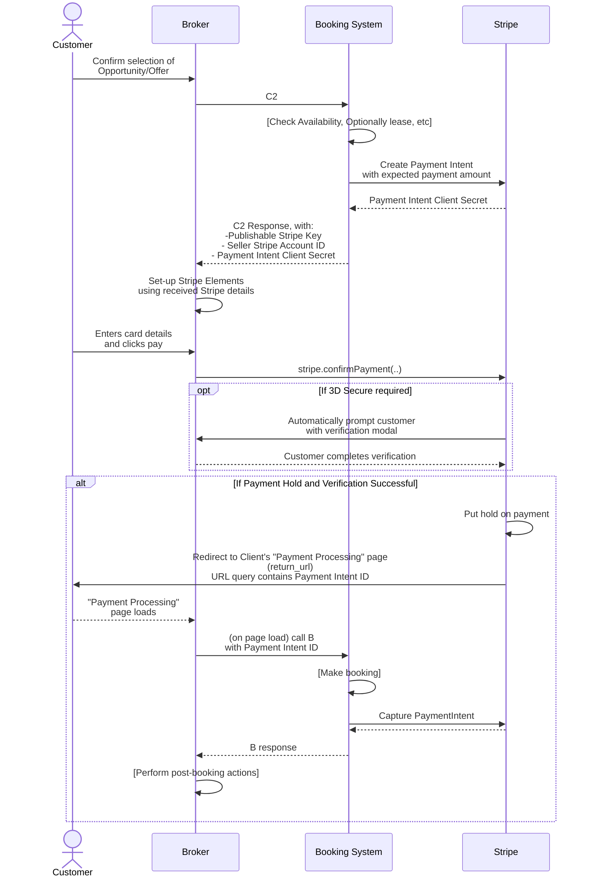

# Open Booking API Stripe Extension

This is the repository of the specification and JSON-LD namespace for an extension for the [Open Booking API](https://openactive.io/open-booking-api/EditorsDraft/1.0CR3/) to handle [Stripe](https://stripe.com/) integrated payments.

> Status: Draft | [Please Provide Feedback via GitHub](https://github.com/openactive/stripe-extension/issues)

## Status

This specification and namespace is in a draft state.

## Overview

This specification includes changes to C2 and B endpoints necessary to integrate the [Stripe Payment Intents API](https://stripe.com/docs/payments/payment-intents) with the Open Booking API.

It is based on the [Integrated Payments example](https://openactive.io/open-booking-api/EditorsDraft/1.0CR3/#extension-example-integrated-payments) in the Open Booking API specification, and Stripe's own [best practices](https://stripe.com/docs/payments/payment-intents#best-practices).

Please note:
- As per the Open Booking API specification, this extension should be implemented as an optional feature for Brokers that require it. Full conformance to the Open Booking API specification cannot be reached by a Booking System if all Brokers MUST use the extension to interact with the API. This is because enforcing a single payment provider severely limits the available use cases and business models within the OpenActive ecosystem.
- This extension cannot be integrated into the Open Booking API specification itself as it is vendor-specific, and hence it is not appropriate within the core of an open standard.

Additionally note that [Payment reconciliation detail validation](https://openactive.io/open-booking-api/EditorsDraft/1.0CR3/#payment-reconciliation-detail-validation) cannot be used in conjunction with this Stripe extension, as reconciliation is handled entirely by the Booking System in this case.

## Changes to Simple Booking Flow

The sequence diagram below outlines the changes to the Simple Booking Flow when the Stripe Extension is in use:




## Referencing the namespace

The namespace MUST be referenced using the URL `"https://openactive.io/stripe-extension"` (which will return the [JSON-LD definition](https://openactive.io/stripe-extension/stripe-extension.jsonld) if the `Accept` header contains `application/ld+json`), and is designed to be used in conjunction with the `"https://openactive.io/"` namespace.

## Context

When this extension is in use, the `"@context"` of all requests and responses to the Open Booking API should include the namespace reference as follows:

```json
{
  "@context": [
    "https://openactive.io/",
    "https://openactive.io/stripe-extension"
  ],
  "@type": "Order",
  ...
}
```

Note as above, in order to conform to the Open Booking API, a Booking System MUST respond to standard Open Booking API requests (that do not include this additional namespace in the `"@context"`) as per the Open Booking API specification.

## Requests and responses

The Booking System MUST process requests as defined in this extension, only if `stripe:paymentPageUrl` is present inside a `stripe:PaymentIntent` within the `payment` property of a **C2**, **B**, or **P** call:

```json
"payment": {
  "@type": "stripe:PaymentIntent",
  "stripe:paymentPageUrl": "https://example.com/checkout"
}
```

If the `payment` is of any other `@type`, the Booking System MUST treat the request as if Stripe extension is not implemented.

The Stripe Extension MUST be used consistently (or not) for a given Order UUID.

### C1/C2 request

The Broker uses a `"stripe:PaymentIntent"` within `payment` to indicate an intention to use Stripe for integrated payments, as it would with Payment reconciliation detail validation. The Broker MUST specify the web page or app on which Stripe will be used. This allows the booking system to authorise and track the usage of Stripe, which will aid PCI-DSS compliance.

```json
"payment": {
  "@type": "stripe:PaymentIntent",
  "stripe:paymentPageUrl": "https://example.com/checkout"
}
```

Note that some Broker use cases will capture the `customer` details on the same page as the card details, and the Stripe Extension MUST be used consistently (or not) for the same Order UUID, hence the above MUST be included in both C1 and C2.

### C1/C2 response

The C1 and C2 responses each provide enough information for the Broker to authorise the Payment Intent (invoking 3D Secure as necessary). They also reflect back the provided `payment` data.

```json
"stripe:paymentRequest": {
  "@type": "stripe:PaymentIntent",
  "identifier": "pi_1GPsnyKarmweGdVC5WhNworN", // payment intent ID
  "stripe:clientSecret": "pi_1GPsnyKarmweGdVC5WhNworN_secret_LgKKeZNVv4XlayiahHTt3YjHA",
  "stripe:publishableKey": "pk_test_4JnvQX1ZfhZacZh3ZiLOrAXq",
  "stripe:connectAccountIdentifier": "acct_24BFMpJ1svR5A89k"
},
"payment": {
  "@type": "stripe:PaymentIntent",
  "stripe:paymentPageUrl": "https://example.com/checkout"
}
```

The contents of `stripe:paymentRequest` MUST be identical in both **C1** and **C2** responses.

`stripe:paymentRequest` MUST only be present in **C1** and **C2** responses when `totalPaymentDue` contains a non-zero `price`.

### Orders feed (Approval Flow with Proposal Amendment only)

For the Approval Flow, where [Proposal Amendment](https://openactive.io/open-booking-api/EditorsDraft/1.0CR3/#proposal-amendment) is supported, a new `stripe:paymentRequest` may be present in the revised `OrderProposal` in the Order Proposals feed. This is only present in the case that the `totalPaymentDue` has increased since **P**, and where [incremental authorization](https://stripe.com/docs/terminal/features/incremental-authorizations) has failed.

```json
"stripe:paymentRequest": {
  "@type": "stripe:PaymentIntent",
  "identifier": "pi_1GPsnyKarmweGdVC5WhNworN", // new payment intent ID
  "stripe:clientSecret": "pi_1GPsnyKarmweGdVC5WhNworN_secret_LgKKeZNVv4XlayiahHTt3YjHA",
  "stripe:publishableKey": "pk_test_4JnvQX1ZfhZacZh3ZiLOrAXq",
  "stripe:connectAccountIdentifier": "acct_24BFMpJ1svR5A89k"
}
```

### B/P request and response

The Broker MUST include the Payment Intent identifier in the request, and the Booking System MUST reflect it back in the response. This helps the Booking System to verify that the correct Payment Intent has been used by the Broker to accept a payment for this Order.

For the Approval Flow, `payment` is only required at **B** in the case that a new  `stripe:paymentRequest` was present in the revised `OrderProposal` in the Order Proposals feed (which is only possible if [Proposal Amendment](https://openactive.io/open-booking-api/EditorsDraft/1.0CR3/#proposal-amendment) has been implemented by the Booking System).

Note that if `"@type": "stripe:PaymentIntent"` is included in the **B/P** request, then **C1** or **C2** MUST have been called previously to retrieve a `stripe:paymentRequest`.

In keeping with the specification, `payment` MUST NOT be present where the `totalPaymentDue` at **C2** is of zero `price`.

#### B/P request
```json
"payment": {
  "@type": "stripe:PaymentIntent",
  "stripe:paymentPageUrl": "https://example.com/checkout",
  "identifier": "pi_1GPsnyKarmweGdVC5WhNworN" // payment intent ID
}
```

#### B/P response
```json
"payment": {
  "@type": "stripe:PaymentIntent",
  "stripe:paymentPageUrl": "https://example.com/checkout",
  "identifier": "pi_1GPsnyKarmweGdVC5WhNworN" // payment intent ID
}
```

## Errors

A pass-through approach for errors from the Stripe API ensures that the Broker has as much information as possible about any errors that occur, and can display messages to the end-user as appropriate.

### `OpenBookingError` subclasses

A number of `oa:OpenBookingError` subclasses are defined to identify the problem type of various error conditions. These are based on Stripe's own [error types](https://stripe.com/docs/api/errors#errors-type), and pass through any errors received from Stripe. All other errors defined here subclass `stripe:Error`, which subclasses `oa:OpenBookingError`.

| Error Type (`@type`)                        | Status Code (`oa:statusCode`) | Use Case (`schema:name`)                                                                                                                                                     |
|---------------------------------------------|-------------|------------------------------------------------------------------------------------------------------------------------------------------------------------------------------------------------|
| `stripe:Error`                              | 400         | A problem with Stripe was encountered that did not have a known [error type](https://stripe.com/docs/api/errors#errors-type) |
| `stripe:ApiError`                           | 400         | API error from Stripe's servers |
| `stripe:CardError`                          | 400         | The user has provided a card that cannot be charged |
| `stripe:IdempotencyError`                   | 409         | An `Idempotency-Key` was re-used on a request to Stripe that did not match the first request's API endpoint and parameters |
| `stripe:InvalidRequestError`                | 400         | Request to Stripe has invalid parameters |
| `stripe:MissingPaymentIntentDetailsError`   | 400         | `stripe:PaymentIntent` details `identifier` and `stripe:paymentPageUrl` were expected at **B**/**P**, but were not set. |
| `stripe:PaymentIntentContainsExcessivePropertiesError`| 400     | `stripe:PaymentIntent` MUST NOT contain `identifier` at **C1** or **C2**. |
| `stripe:PaymentIntentMismatchError`         | 400         | `stripe:PaymentIntent` `identifier` at **B**/**P** does not match the `identifier` provided by the **C2** response for this `Order`. |

Every error returned from Stripe should map onto either `stripe:ApiError`, `stripe:CardError`, `stripe:IdempotencyError`, or `stripe:InvalidRequestError` depending on the [`type`](https://stripe.com/docs/api/errors#errors-type) returned in the Stripe error, which has a value of either `api_error`, `card_error`, `idempotency_error`, or `invalid_request_error`.

`stripe:Error` is intended to be returned in the case of unexpected errors from Stripe (i.e. cases where Stripe itself does not return an error, such as a network failure) or errors relating to unexpected Stripe behaviour (i.e. where Stripe behaves in an inconsistent or unexpected way, such as a Payment Intent that was previously created at C2 not being found at B).

Note that `stripe:IdempotencyError` and `stripe:InvalidRequestError` should not occur if the Booking System has implemented this extension correctly.

Note also that `stripe:MissingPaymentIntentDetailsError`, `stripe:PaymentIntentMismatchError` and `stripe:PaymentIntentContainsExcessivePropertiesError` relate to issues with Broker behaviour, and do not originate from Stripe.

### `stripe:Error` property mapping

Attributes from a [Stripe error](https://stripe.com/docs/api/errors) are mapped to properties in [`OpenBookingError`](https://openactive.io/open-booking-api/EditorsDraft/1.0CR3/#oa-openbookingerror), with additional extension properties defined for use on the `stripe:Error`.

| Property                                                           | Stripe [attribute](https://stripe.com/docs/api/errors)      | Type | Notes |
|--------------------------------------------------------------------|-------------|-|------|
| `@type`                                                            | - | [`schema:Text`](https://schema.org/Text) | `stripe:Error` |
| [`schema:name`](https://schema.org/name)                           | - | [`schema:Text`](https://schema.org/Text) | A short, human-readable summary of the problem type, that MUST communicate the associated "Use Case" defined above. It SHOULD NOT change from occurrence to occurrence of the problem, except for purposes of localization. |
| [`schema:description`](https://schema.org/description)             | [`message`](https://stripe.com/docs/api/errors#errors-message) | [`schema:Text`](https://schema.org/Text) | A human-readable message providing details about the specific occurrence of the problem. For `stripe:CardError`, these messages can be shown to end users. |
| [`schema:url`](https://schema.org/url)                             | [`doc_url`](https://stripe.com/docs/api/errors#errors-doc_url) | [`schema:URL`](https://schema.org/URL) | A URL to more information about the error code reported. |
| [`stripe:parameter`](https://openactive.io/stripe-extension#parameter)     | [`param`](https://stripe.com/docs/api/errors#errors-param) | [`schema:Text`](https://schema.org/Text) | If the error is parameter-specific, the parameter related to the error. For example, you can use this to display a message near the correct form field. |
| [`stripe:errorCode`](https://openactive.io/stripe-extension#errorCode)     | [`code`](https://stripe.com/docs/api/errors#errors-code) | [`schema:Text`](https://schema.org/Text) | For some errors that could be handled programmatically, a short string indicating the [error code](https://stripe.com/docs/error-codes) reported. |
| [`stripe:declineCode`](https://openactive.io/stripe-extension#declineCode) | [`decline_code`](https://stripe.com/docs/api/errors#errors-decline_code) | [`schema:Text`](https://schema.org/Text) | For card errors resulting from a card issuer decline, a short string indicating the [decline code](https://stripe.com/docs/declines/codes), which is the card issuer’s reason for the decline if they provide one. |
| [`oa:instance`](https://openactive.io/instance)                    | [`request_log_url`](https://stripe.com/docs/api/errors#errors-request_log_url) | [`schema:URL`](https://schema.org/URL) | A URL to the request log entry in the Stripe dashboard. |
| [`oa:statusCode`](https://openactive.io/statusCode)                | [`code`](https://stripe.com/docs/api/errors#errors-code)    | [`schema:Integer`](https://schema.org/Integer) | An integer representing the HTTP status code, that MUST match the associated "Status Code" defined above. |


### `stripe:Error` example

```json
{
  "@context": [
    "https://openactive.io/",
    "https://openactive.io/stripe-extension"
  ],
  "@type": "stripe:CardError",
  "name": "The user has provided a card that cannot be charged",
  "description": "Your card's security code is incorrect. Please try again using the correct CVC.",
  "stripe:parameter": "cvc",
  "stripe:errorCode": "card_declined",
  "stripe:declineCode": "incorrect_cvc",
  "instance": "https://dashboard.stripe.com/test/logs/req_1234567890abcdef",
  "statusCode": 400
}
```


### Test Interface Action

Test interface actions are defined to simulate user interactions that would ordinarily be performed on the frontend via Stripe Elements.

#### `stripe:ConfirmPaymentIntentSimulateAction`
This test action simulates the authorisation of a card by confirming the Payment Intent. This is useful for test code that uses [Stripe Test Mode](https://stripe.com/docs/test-mode) to test paid booking on the backend without requiring a frontend instance of Stripe Elements to authorise the card.

```json
{
    "@context": [
        "https://openactive.io/",
        "https://openactive.io/test-interface",
        "https://openactive.io/stripe-extension"
    ],
    "@type": "stripe:ConfirmPaymentIntentSimulateAction",
    "object": {
      "@type": "stripe:PaymentIntent",
      "referencesOrder": {
        "@type": "Order",
        "seller": "https://example.com/api/organisations/123",
      },
      "identifier": "pi_1GPsnyKarmweGdVC5WhNworN" // payment intent ID
    },
    "stripe:paymentMethod": "pm_card_visa"
}
```

Note that the `seller` MUST be included to allow the Booking System to deterimine which Stripe Account that the `stripe:PaymentIntent` is associated with.

For a list of the various test values for `stripe:paymentMethod` (e.g. `pm_card_chargeDeclinedIncorrectCvc`) see the [Stripe documentation](https://stripe.com/docs/testing?testing-method=payment-methods#declined-payments).


# Namespace

